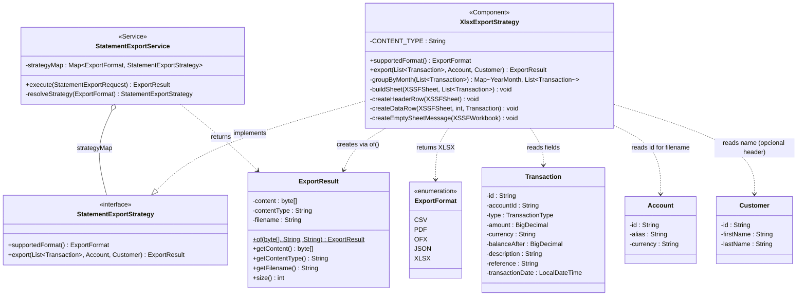
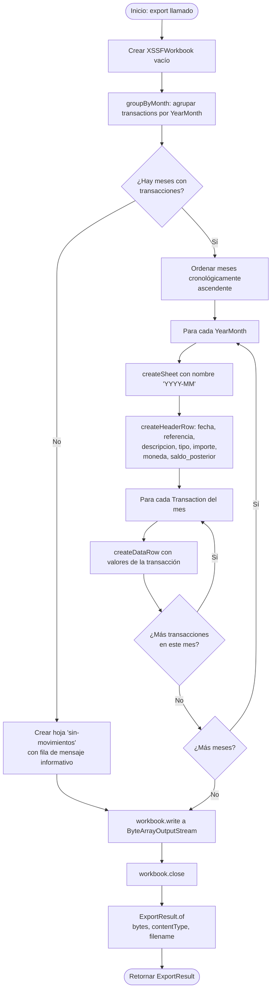

# Diagramas de Solución — task-1xlsx (XLSX Export Strategy)

Diagramas técnicos de la solución propuesta para implementar `XlsxExportStrategy` en el kata-exporter.

---

## 1. Diagrama de Secuencia

Muestra el flujo completo desde la petición HTTP del cliente hasta la descarga del archivo `.xlsx`, incluyendo la agrupación mensual interna de la strategy.

```mermaid
sequenceDiagram
    actor Cliente as Cliente (curl / browser)
    participant Controller as StatementExportController
    participant Service as StatementExportService
    participant AccRepo as AccountRepository
    participant CustRepo as CustomerRepository
    participant TxRepo as TransactionRepository
    participant Strategy as XlsxExportStrategy
    participant POI as Apache POI (XSSFWorkbook)
    participant BAOS as ByteArrayOutputStream

    Cliente->>Controller: GET /api/v1/accounts/{accountId}/statement/export?format=XLSX&dateFrom=...&dateTo=...

    Controller->>Service: execute(StatementExportRequest)

    Service->>AccRepo: findById(accountId)
    AccRepo-->>Service: Optional<Account>
    alt cuenta no encontrada
        Service-->>Controller: throw ExportException(404)
        Controller-->>Cliente: 404 Not Found
    end

    Service->>CustRepo: findByAccountId(accountId)
    CustRepo-->>Service: Optional<Customer>

    Service->>TxRepo: findByAccountIdAndDateRange(accountId, from, to)
    TxRepo-->>Service: List<Transaction>

    Service->>Strategy: export(transactions, account, customer)

    Note over Strategy: Agrupar transacciones por YearMonth
    Strategy->>Strategy: groupByMonth(transactions)<br/>→ Map<YearMonth, List<Transaction>>

    alt sin transacciones en el rango
        Strategy->>POI: workbook.createSheet("sin-movimientos")
        Strategy->>POI: sheet.createRow(0) → mensaje informativo
    else con transacciones
        loop Por cada YearMonth (ordenado cronológicamente)
            Strategy->>POI: workbook.createSheet("YYYY-MM")
            Strategy->>POI: sheet.createRow(0) → fila de encabezado
            loop Por cada Transaction del mes
                Strategy->>POI: sheet.createRow(n) → fila de datos
            end
        end
    end

    Strategy->>BAOS: workbook.write(outputStream)
    Strategy->>POI: workbook.close()
    Strategy-->>Service: ExportResult.of(bytes, contentType, filename)

    Service-->>Controller: ExportResult

    Controller-->>Cliente: 200 OK<br/>Content-Type: application/vnd.openxmlformats-officedocument.spreadsheetml.sheet<br/>Content-Disposition: attachment; filename="movimientos-{accountId}.xlsx"<br/>Body: byte[]
```

---

## 2. Diagrama de Clases

Muestra la estructura estática de los componentes involucrados, sus relaciones, atributos y métodos relevantes para la solución.



---

## 3. Diagrama de Flujo Interno — Agrupación mensual

Ilustra la lógica de agrupación y construcción del workbook dentro de `XlsxExportStrategy.export()`.


