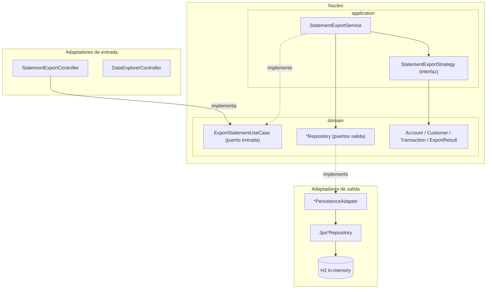
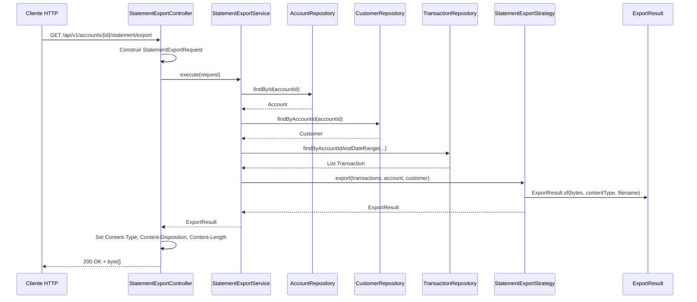

# Diagramas de arquitectura

Este documento contiene los diagramas Mermaid de referencia del proyecto **kata-exporter**.  
Para el contexto arquitectónico y las clases involucradas, ver [ARCHITECTURE.md](ARCHITECTURE.md).

---

## 1. Arquitectura hexagonal

Vista de capas: adaptadores de entrada, núcleo (dominio + aplicación) y adaptadores de salida.

**Notas:**

- `StatementExportController` delega al puerto de entrada `ExportStatementUseCase`, implementado por `StatementExportService`.
- `DataExplorerController` accede directamente a los repositorios JPA (excepción pragmática para explorar datos durante la kata).
- Los strategies de exportación viven en `application/strategy/` y operan solo sobre modelos de dominio.

---

## 2. Flujo de una exportación

Secuencia desde la petición HTTP hasta la respuesta con el archivo generado.

**Puntos clave del flujo:**

1. El controller traduce parámetros HTTP a `StatementExportRequest` (Builder).
2. El service valida existencia de cuenta y cliente, y recupera transacciones del rango.
3. El strategy correcto se resuelve por `ExportFormat` desde un mapa inyectado por Spring.
4. El strategy genera el contenido **en memoria** y retorna `ExportResult`.
5. Solo el controller escribe la respuesta HTTP (headers + body).
